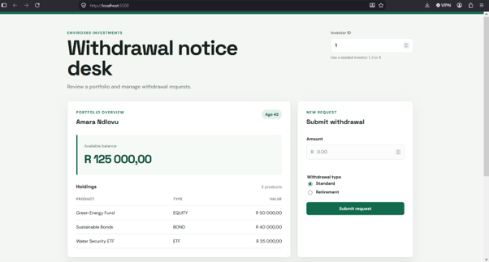
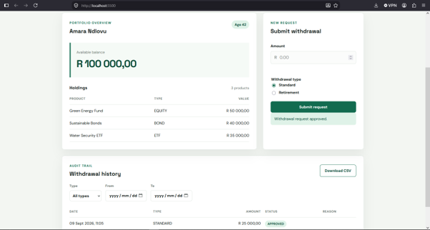
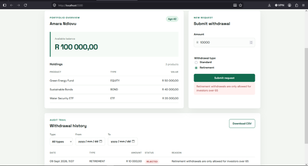
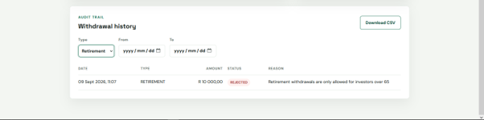

# Enviro365 Withdrawal Notice System

Full-stack assessment solution for Enviro365 Investments: a system for viewing an
investor's portfolio, submitting withdrawal notices against it (with business-rule
validation), and exporting a filtered CSV statement.

## Tech stack

- **Backend:** Java 17, Spring Boot 3.3.5 (Web, Data JPA, Validation), H2 in-memory database
- **Frontend:** Plain HTML/CSS/JavaScript (no framework), using the Fetch API
- **Testing:** JUnit 5, Mockito, Spring `MockMvc`

## Project structure

```
back end/   Spring Boot API (note: folder name contains a space, preserved as-is)
frontend/   Static HTML/CSS/JS UI
```

## Setup & run

### Backend

Prerequisites: JDK 17, Maven.

```bash
cd "back end"
mvn spring-boot:run
```

- API runs on `http://localhost:8080`
- H2 console: `http://localhost:8080/h2-console` (JDBC URL `jdbc:h2:mem:enviro365`, user `sa`, no password)
- On startup, `DataSeeder` loads 3 investors (IDs 1–3) with portfolios and products if the
  database is empty.

Run the test suite with:

```bash
mvn test
```

### Frontend

Static site, no build step. Serve it with any static file server, e.g.:

```bash
cd frontend
python -m http.server 5500
```

Then open `http://localhost:5500`. The frontend calls the API at
`http://localhost:8080` (configurable via `API_BASE_URL` in `frontend/js/api.js`).

Because the frontend and backend run on different ports, the backend enables CORS for
`/api/**` (see `WebConfig.java`) so the browser will allow the requests.

## API documentation

| Method | Endpoint | Description |
|---|---|---|
| `GET` | `/api/investors/{investorId}/portfolio` | Investor details, balance, and product holdings |
| `POST` | `/api/withdrawals` | Submit a withdrawal request. Returns `201 Created` on approval, `400 Bad Request` with rejection detail on business-rule failure |
| `GET` | `/api/withdrawals/{investorId}` | Withdrawal history for an investor, newest first |
| `GET` | `/api/withdrawals/{investorId}/export?type=&from=&to=` | Downloads a CSV statement, optionally filtered by `type` (`STANDARD`/`RETIREMENT`) and/or a `from`/`to` date range (`yyyy-MM-dd`) |

**POST `/api/withdrawals` request body**

```json
{ "investorId": 1, "amount": 250.00, "type": "STANDARD" }
```

**Error response shape** (all errors share this shape)

```json
{
  "timestamp": "2026-09-09T12:00:00",
  "status": 400,
  "error": "Bad Request",
  "message": "Withdrawal amount must not exceed the portfolio balance",
  "validationErrors": { "amount": "amount must be greater than zero" },
  "rejection": { "id": 4, "status": "REJECTED", "reason": "..." }
}
```

- `validationErrors` is populated for request-body validation failures (missing/invalid fields).
- `rejection` is populated with the persisted, rejected withdrawal notice when a business rule
  blocks the request (the attempt is still recorded in history).

## Business rules

- Retirement withdrawals are only allowed for investors older than 65.
- A withdrawal amount must not exceed the portfolio balance.
- A withdrawal amount must not exceed 90% of the portfolio balance.
- Rejected attempts are still saved to history with a reason, and the frontend refreshes
  history after both successful and rejected submissions.

## Advanced features implemented (3+ required)

- **Global exception handling** — `GlobalExceptionHandler` covers validation errors, malformed
  JSON, business-rule rejections, not-found resources, bad requests, and a catch-all fallback
  for anything unexpected.
- **DTO layer** — `WithdrawalRequest`/`WithdrawalResponse`/`PortfolioResponse` mean JPA entities
  never leave the service layer.
- **Input validation** — Bean Validation (`@NotNull`, `@Positive`) on the request DTO, on top of
  the explicit business-rule checks in `WithdrawalService`.
- **UI validation** — the amount field is validated client-side (required, positive, within
  balance) before a request is ever sent, and server-side field errors are also surfaced if the
  backend rejects the request.
- **Unit tests** — service-layer tests (`WithdrawalServiceTest`, `PortfolioServiceTest`) and
  web-layer tests (`WithdrawalControllerTest`, `PortfolioControllerTest` via `@WebMvcTest`/`MockMvc`).

## Known limitations / possible follow-ups

- CORS currently allows all origins (`allowedOriginPatterns("*")`) for local development
  convenience; a real deployment should restrict this to the frontend's actual origin(s).
- No pagination on withdrawal history or CSV export — fine at seed-data scale, would need it
  for production data volumes.
- No authentication/authorization layer, which is out of scope for this assessment.

## Screenshots

### Portfolio dashboard


### Successful withdrawal


### Rejected withdrawal


### Filtered withdrawal history

